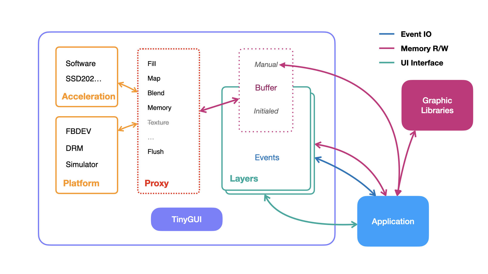

## Architecture

TinyGUI doing buffer control and blend acceleration but no painting or graphic calculation. 

The rendering pipeline structured on the below:

So, graphic libs have ability request buffer to painting and send buffer fill/blend/rendering requests to acceleration platform by proxy methods.

TinyGUI
  - Layer
    - Event
    - Buffer
  - Proxy 
  - Platform
